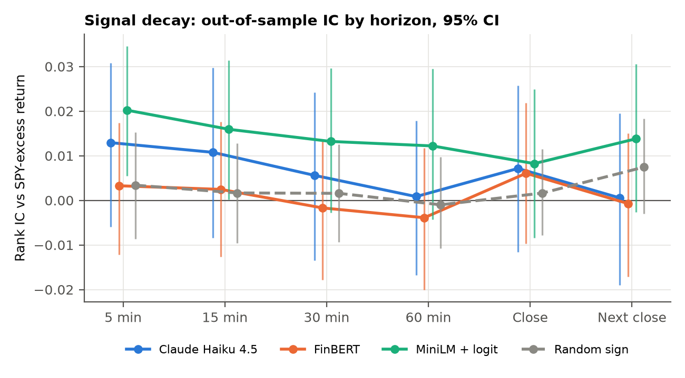

# LLM News Sentiment Signal Study

Does LLM-scored sentiment on real-time equity headlines predict forward returns? How fast does the signal decay, and does anything survive transaction costs?

Claude Haiku 4.5 scores Benzinga headlines for 30 S&P 500 large caps (Sep 2025 to Aug 2026). FinBERT, an embedding + logistic-regression model and a random-sign control score the same headlines. The prompt and all parameters are frozen on Sep to Nov 2025; **every reported number is out of sample (Dec 2025 to Aug 2026).**

<!-- results:start -->


- **Sample:** 41,286 headline-ticker events, 30,792 out of sample over 189 trading days.
- **Decay:** LLM rank IC +0.013 at 5 min, +0.006 at 30 min [-0.013, +0.024], +0.007 by the close.
- **vs FinBERT at 30 min:** IC difference +0.007, 95% CI [-0.007, +0.022].
- **Backtest (30-min exit, 60 s delay):** 839 trades, +6.11 bps gross per trade (95% CI [-8.8, +20.0]), -12.24 bps net after 18.35 bps of costs; Sharpe +1.50 gross, -2.99 net.
- **Latency (regular-hours headlines, 30-min IC):** +0.023 at 0 s, +0.021 at 60 s, +0.018 at 300 s, +0.011 at 900 s.
- **Verdict:** The signal first, then costs. At the 30-minute exit the gross edge is +6.1 bps per trade with a 95% CI of [-8.8, +20.0], so it cannot be told apart from zero. Costs then remove any doubt: 18.3 bps per round trip (10 bps of fees, 8.3 bps of estimated spread), and even with zero fees the net edge is -2.2 bps.
- **LLM API spend:** $6.98 for all 41,286 events (Claude Haiku 4.5, Batches API).
<!-- results:end -->

Full writeup: [`reports/writeup.pdf`](reports/writeup.pdf).

## How to run

```bash
make setup                 # Python 3.13 venv + requirements
cp .env.example .env       # add Alpaca paper keys and an Anthropic API key
make data                  # news, minute/daily bars, calendar -> dedupe -> entry bars + forward returns
make score-llm-estimate    # prompt token count and projected LLM spend, no API calls beyond count_tokens
make spotcheck             # 50 in-sample headlines -> reports/llm_spotcheck.md for a manual label check
make score                 # Claude (cached, spend-capped via LLM_MAX_USD), FinBERT, embedding logit
make eval backtest report  # IC tables, backtest, figures, writeup.pdf
make test                  # no-lookahead, cost model, IC, dedup, end-to-end smoke test
make dashboard             # Streamlit: decay, equity curves, headline explorer, live log
make live-dry              # live websocket demo, scoring only (make live places paper orders)
```

## Design

| Piece | Choice |
|---|---|
| Entry | Open of the first regular-hours minute bar starting at or after headline + 60 s. Off-hours headlines enter at the next open. |
| Returns | 5, 15, 30, 60 min, close, next close; excess of SPY over the identical window |
| IC | Spearman, pooled OOS events; 95% CI from a trading-day block bootstrap (paired across models) |
| Trade rule | LLM: \|sentiment\| >= 0.5 and confidence >= 0.6. Baselines: same in-sample trade rate. |
| Book | Long/short, 1/10 of capital per headline, max 10 open |
| Costs | 5 bps per side + half-spread from the pre-entry minute-bar high-low range |
| Latency | Entry delays of 0, 60, 300, 900 s |

`tests/test_align.py` proves no forward return uses a bar before the entry bar, and that the entry bar never starts before the decision time.

## Layout

```
src/ingest.py         Alpaca news + bars + calendar -> parquet; multi-ticker explode; near-duplicate filter
src/align.py          entry bar, forward returns, SPY-excess returns, half-spread proxy
src/score_llm.py      Claude Haiku 4.5, temperature 0, JSON schema, prompt caching, disk cache, cost log
src/score_finbert.py  ProsusAI/finbert
src/score_embed.py    all-MiniLM-L6-v2 + logistic regression trained in-sample
src/evaluate.py       IC, day-block bootstrap, hit rate, category / session / confidence breakdowns
src/backtest.py       event-driven simulator, cost model, latency and fee sweeps
src/figures.py        charts -> reports/figures/
src/report.py         writeup.md + README results from reports/tables -> pandoc -> writeup.pdf
prompts/llm_v1.md     the frozen prompt
live/stream.py        websocket demo with paper orders (demo only, not a results source)
dashboard/app.py      Streamlit
```
