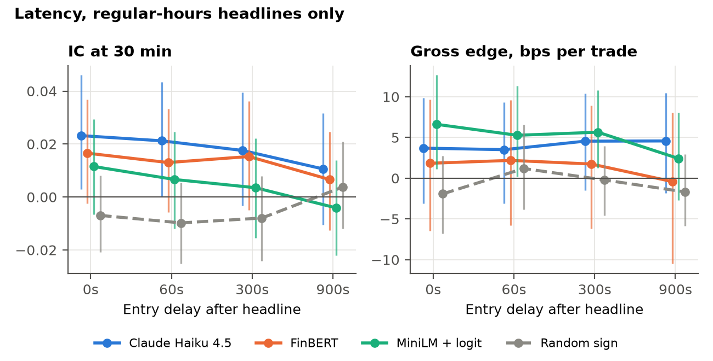
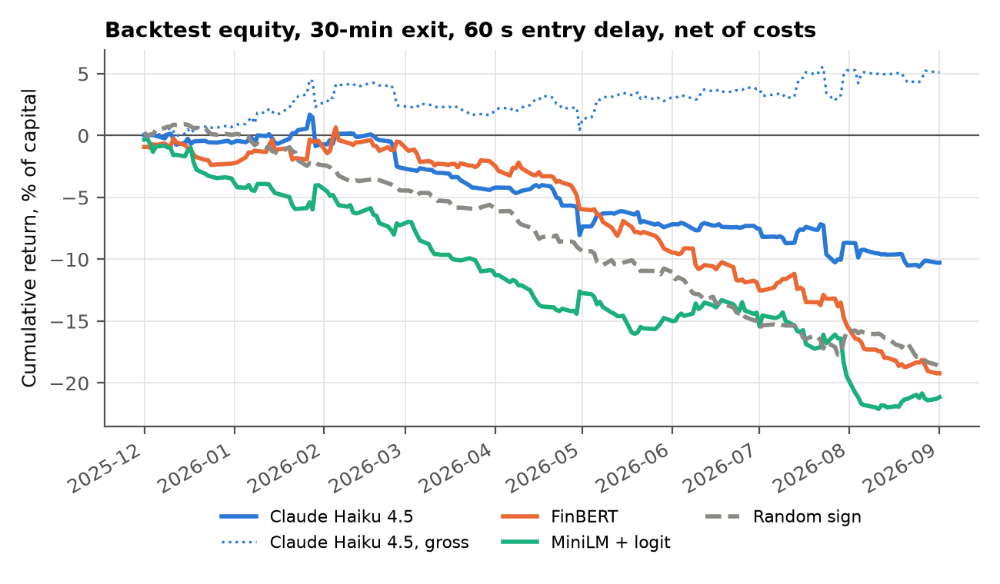
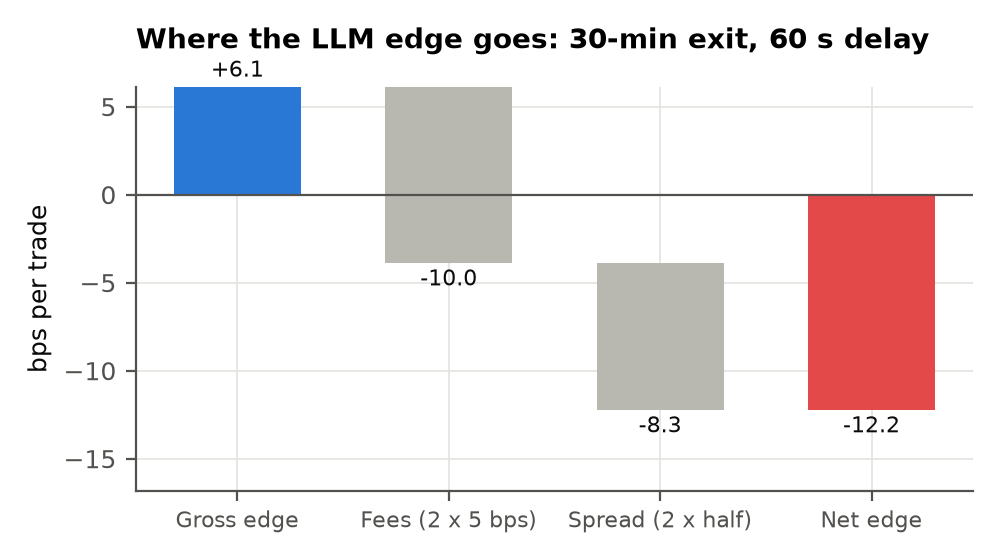
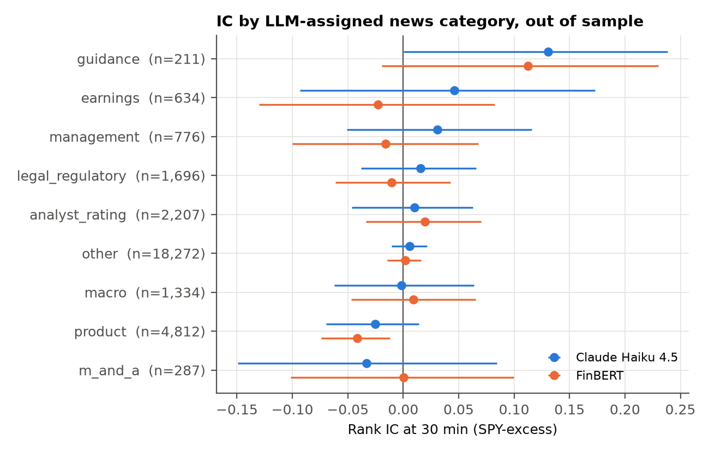
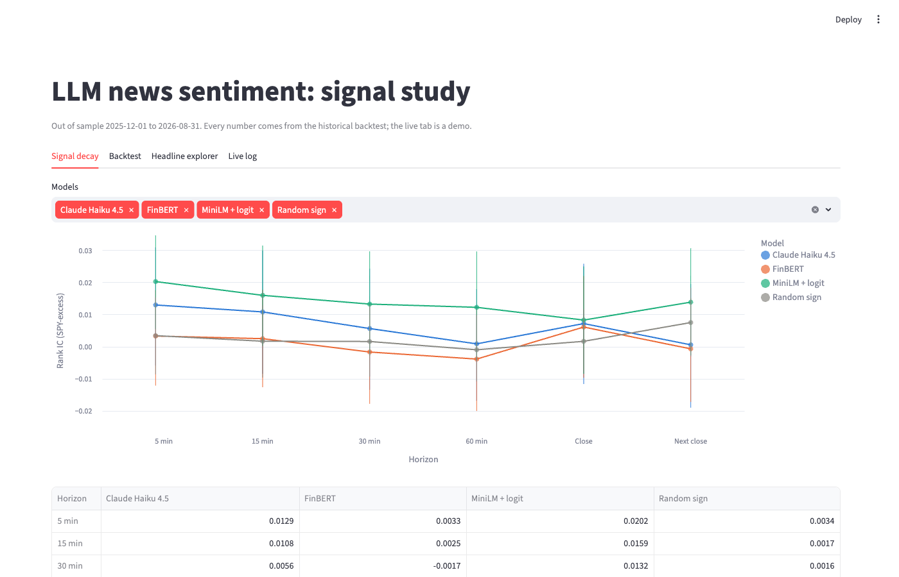

# Question

Can a small, cheap LLM read a real-time equity headline and tell you which way the stock moves next? If it can, how long does the information last, and is anything left after paying to trade it?

I test this on Benzinga headlines for 30 high-news-volume S&P 500 stocks from 2025-09-01 to 2026-08-31. Claude Haiku 4.5 scores each headline, and I compare it with FinBERT, a supervised embedding model and a random-sign control. The prompt and every fitted parameter were frozen using data through 2025-11-30. **Every result below is out of sample: 30,792 events over 189 trading days.**

# Answers in brief

1. **Hypothesis and lookahead.** The hypothesis: headline sentiment predicts the stock's return relative to SPY after the headline. Each trade enters at the open of the first minute bar that starts at least 60 seconds after the headline timestamp, and every exit bar starts at or after the entry bar. Events are assigned to the in-sample or OOS window by the date the trade enters, not the date of the headline. Unit tests on synthetic bars check all three properties, including half days and overnight headlines.
2. **Decay.** Pooled over all OOS headlines, the LLM's rank IC is +0.013 at 5 minutes, +0.006 at 30 minutes and +0.007 at the close. Horizons whose 95% CI excludes zero: none. The pooled signal is too weak to trace a decay curve. On headlines that arrive during market hours, the 30-minute IC falls from +0.023 with no delay to +0.021 at 60 s, +0.018 at 5 minutes and +0.011 at 15 minutes. The point estimates fall steadily and the CI excludes zero only at 0 s and 60 s, but the intervals overlap heavily, so the decline is suggestive rather than established. If there is an edge, it belongs to whoever reads the headline within about a minute.
3. **LLM vs FinBERT.** At 30 minutes the LLM's IC exceeds FinBERT's by +0.007, with a paired 95% CI of [-0.007, +0.022]. The LLM did not beat FinBERT by a statistically reliable margin at 30 minutes: the paired bootstrap CI on the difference includes zero. An IC ratio is not meaningful, because the FinBERT IC is not distinguishable from zero.
4. **What killed net returns.** The signal first, then costs. At the 30-minute exit the gross edge is +6.1 bps per trade with a 95% CI of [-8.8, +20.0], so it cannot be told apart from zero. Costs then remove any doubt: 18.3 bps per round trip (10 bps of fees, 8.3 bps of estimated spread), and even with zero fees the net edge is -2.2 bps. Latency did not: pooled gross edge is +5.95 bps with no delay and +6.12 bps at 15 minutes, because most LLM trades come from off-hours headlines that enter at the open regardless.
5. **Next.** Condition on the few places the signal showed up (regular-hours headlines, guidance news, a 5-minute exit) and test them on a fresh window; replace the spread proxy with quotes; add the consensus estimate to earnings headlines. Details in the last section.

# Data

- **News.** Alpaca News API (Benzinga feed): 26,899 articles tagged to the universe. An article tagged to several universe tickers becomes one event per ticker, scored separately for each; 52% of events come from multi-ticker articles. I drop a headline when the same ticker had one with token Jaccard similarity of 0.8 or more in the prior 10 minutes, which removed only 48; 41,286 events remain.
- **Prices.** Alpaca IEX minute bars and daily bars, split-adjusted, for the 30 stocks and SPY. The trading calendar comes from Alpaca, so half days close at 13:00.
- **Timestamps.** Stored in UTC, displayed in New York time.

# Method

**Entry and exit.** The decision time is the headline timestamp plus a delay (60 seconds primary). Entry is the open of the first regular-hours bar starting at or after the decision time. A headline outside 09:30 to 16:00 enters at the next session's first bar; 45% of OOS headlines arrived during regular hours. Intraday exits are the close of the last bar that ends by entry plus the horizon. A horizon that would run past the close is dropped, not truncated. Returns are measured net of SPY over the identical window.

**Scores.**

- *Claude Haiku 4.5* (the cheapest current Claude model): temperature 0, JSON-schema output (`ticker`, `sentiment` in [-1, 1], `confidence` in [0, 1], `category`), a frozen prompt with a scoring rubric, a 30-name reference table and 12 hand-written examples. Two prompt versions were tried on 50 in-sample headlines; v2 fixed two category rules and was frozen (`reports/prompt_log.md`). To cut cost, events go 20 per request through the Message Batches API, grouped at random across the year so no request holds a follow-up story next to the news it describes. On 1,486 events scored both ways, batch and one-at-a-time scoring agree: sentiment correlation 0.83, sign agreement 92%, category agreement 88%, and trade-decision agreement 98%. Total API spend: $6.98, of which $1.25 is estimated for a one-at-a-time run I stopped before it logged usage.
- *FinBERT* (ProsusAI/finbert): P(positive) minus P(negative).
- *Embedding logit*: all-MiniLM-L6-v2 headline embeddings into an L2 logistic regression for the sign of the 30-minute excess return, trained on 10,253 in-sample events with day-grouped cross-validation (CV AUC 0.511).
- *Random sign*: a coin flip per event.

**Evaluation.** IC is the Spearman correlation between score and forward excess return over OOS events. Confidence intervals resample whole trading days (2,000 replicates), because headlines on the same day share market shocks. Every replicate scores all models on the same days, which gives paired CIs for model differences.

**Backtest.** One position per qualifying headline, long if the score is positive and short if negative, each at 1/10 of capital, with at most 10 open. The LLM trades when |sentiment| is at least 0.5 and confidence at least 0.6, which selected 3.8% of in-sample events. Each baseline gets the |score| cutoff that trades the same fraction of in-sample events. Costs per side are 5 bps plus half the spread, proxied by the median (high - low) / close over the 30 bars before entry. Sharpe is annualized from per-trade returns as specified; because positions overlap, I also report a daily-PnL Sharpe.

# Results

## Signal decay

| Horizon | Haiku | FinBERT | Embed | Random |
|------------|--------------------:|--------------------:|--------------------:|--------------------:|
| 5 min | +.013 [-.01, +.03] | +.003 [-.01, +.02] | +.020 [+.01, +.03] | +.003 [-.01, +.02] |
| 15 min | +.011 [-.01, +.03] | +.002 [-.01, +.02] | +.016 [+.00, +.03] | +.002 [-.01, +.01] |
| 30 min | +.006 [-.01, +.02] | -.002 [-.02, +.01] | +.013 [-.00, +.03] | +.002 [-.01, +.01] |
| 60 min | +.001 [-.02, +.02] | -.004 [-.02, +.01] | +.012 [-.00, +.03] | -.001 [-.01, +.01] |
| Close | +.007 [-.01, +.03] | +.006 [-.01, +.02] | +.008 [-.01, +.02] | +.002 [-.01, +.01] |
| Next close | +.001 [-.02, +.02] | -.001 [-.02, +.02] | +.014 [-.00, +.03] | +.007 [-.00, +.02] |

Each cell is the rank IC with its 95% CI; 30,229 events at 30 minutes. Haiku = Claude Haiku 4.5, Embed = MiniLM embedding logit, Random = random-sign control.

The embedding baseline is the only model whose pooled CI excludes zero at any horizon (5 min: +0.020; 15 min: +0.016), despite a near-chance in-sample AUC. I have not established why; see "What didn't work".

## LLM versus FinBERT

| Horizon | LLM IC | FinBERT IC | Difference | CI low | CI high | Bootstrap P(diff <= 0) |
|------------|--------:|------------:|------------:|--------:|---------:|------------------------:|
| 5 min | +0.013 | +0.003 | +0.010 | -0.004 | +0.024 | 0.083 |
| 15 min | +0.011 | +0.002 | +0.008 | -0.008 | +0.025 | 0.160 |
| 30 min | +0.006 | -0.002 | +0.007 | -0.007 | +0.022 | 0.170 |
| 60 min | +0.001 | -0.004 | +0.005 | -0.010 | +0.018 | 0.254 |
| Close | +0.007 | +0.006 | +0.001 | -0.015 | +0.018 | 0.444 |
| Next close | +0.001 | -0.001 | +0.001 | -0.013 | +0.015 | 0.435 |

## Latency

Rank IC at 30 minutes by entry delay, regular-hours headlines only (n = 13,429 at 60 s):

| Entry delay | Haiku | FinBERT | Embed | Random |
|-------------|--------------------:|--------------------:|--------------------:|--------------------:|
| 0 s | +.023 [+.00, +.05] | +.017 [-.00, +.04] | +.012 [-.01, +.03] | -.007 [-.02, +.01] |
| 60 s | +.021 [+.00, +.04] | +.013 [-.01, +.03] | +.007 [-.01, +.02] | -.010 [-.03, +.01] |
| 300 s | +.018 [-.00, +.04] | +.015 [-.00, +.04] | +.004 [-.02, +.02] | -.008 [-.02, +.01] |
| 900 s | +.011 [-.01, +.03] | +.007 [-.01, +.02] | -.004 [-.02, +.01] | +.004 [-.01, +.02] |

## Backtest

Primary configuration (LLM, 30-minute exit, 60-second delay): 839 trades, hit rate 52.9%, +6.11 bps gross per trade (95% CI [-8.8, +20.0]) and -12.24 bps net after 18.35 bps of round-trip cost. Per-trade Sharpe is +1.50 gross and -2.99 net; daily-PnL Sharpe is -2.03 net. Max drawdown is -12.3% of capital on the additive equity curve that fixed 1/10-capital slots imply. Turnover is 0.89x capital per day. 35% of LLM trades come from regular-hours headlines; the rest enter at the open.

| Model | Exit | Trades | Hit | Gross | Gross CI | Net | SR gross | SR net | Max DD |
|---------|--------:|--------:|-------:|-------:|------------:|-------:|----------:|--------:|--------:|
| Haiku | 5 min | 853 | 53.2% | +14.4 | [+3, +27] | -3.9 | +5.10 | -1.39 | -7.2% |
| Haiku | 30 min | 839 | 52.9% | +6.1 | [-9, +20] | -12.2 | +1.50 | -2.99 | -12.3% |
| Haiku | Close | 792 | 51.5% | +13.2 | [-12, +34] | -4.7 | +1.97 | -0.70 | -13.6% |
| FinBERT | 5 min | 1,237 | 52.2% | +2.3 | [-2, +7] | -16.0 | +1.35 | -9.13 | -19.7% |
| FinBERT | 30 min | 1,208 | 52.2% | +2.5 | [-7, +11] | -15.9 | +0.86 | -5.49 | -19.9% |
| FinBERT | Close | 1,095 | 49.2% | -4.2 | [-25, +15] | -22.4 | -0.83 | -4.42 | -29.1% |
| Embed | 5 min | 1,808 | 50.1% | +3.0 | [-1, +8] | -14.6 | +2.32 | -11.02 | -26.2% |
| Embed | 30 min | 1,766 | 52.1% | +5.7 | [-1, +13] | -12.0 | +2.67 | -5.64 | -21.9% |
| Embed | Close | 1,504 | 52.6% | +6.7 | [-7, +20] | -10.8 | +1.70 | -2.73 | -17.9% |
| Random | 5 min | 1,125 | 49.9% | +1.0 | [-3, +5] | -16.7 | +0.55 | -8.76 | -18.9% |
| Random | 30 min | 1,105 | 48.7% | +0.9 | [-5, +8] | -16.9 | +0.34 | -6.12 | -19.6% |
| Random | Close | 1,085 | 51.3% | -0.8 | [-10, +9] | -18.6 | -0.18 | -4.17 | -21.8% |

Gross and net are bps per trade; SR is per-trade Sharpe, annualized; Max DD is on the additive equity curve. Daily-PnL Sharpe for every configuration is in `reports/tables/backtest_summary.csv`.

The one configuration with a gross edge that clears zero is the LLM at a 5-minute exit: +14.4 bps per trade, CI [+2.7, +27.3], over 853 trades. It still loses -3.9 bps net after 18.4 bps of costs. It is also one of 6 exit and delay configurations I ran for the LLM, and the edge comes from headlines traded at the open: restricted to regular-hours headlines it is +2.7 bps, CI [-0.7, +6.3] (312 trades).

Cost sensitivity, LLM at the 30-minute exit:

| Fee bps / side | Gross bps | Total cost bps | Net bps | Sharpe net |
|----------------|-----------:|----------------:|---------:|------------:|
| 0.0 | +6.11 | +8.35 | -2.24 | -0.55 |
| 1.0 | +6.11 | +10.35 | -4.24 | -1.04 |
| 2.5 | +6.11 | +13.35 | -7.24 | -1.77 |
| 5.0 | +6.11 | +18.35 | -12.24 | -2.99 |
| 10.0 | +6.11 | +28.35 | -22.24 | -5.44 |

## Which news moves prices

| Category | Events | LLM IC | CI low | CI high | FinBERT IC | Mean |move| bps |
|------------------|--------:|--------:|--------:|---------:|------------:|-----------------:|
| guidance | 211 | +0.131 | +0.001 | +0.238 | +0.112 | 139.4 |
| earnings | 634 | +0.046 | -0.093 | +0.173 | -0.023 | 109.5 |
| management | 776 | +0.031 | -0.051 | +0.116 | -0.016 | 80.6 |
| legal_regulatory | 1,696 | +0.015 | -0.038 | +0.066 | -0.011 | 64.8 |
| analyst_rating | 2,207 | +0.010 | -0.047 | +0.063 | +0.020 | 69.1 |
| other | 18,272 | +0.006 | -0.010 | +0.021 | +0.002 | 60.4 |
| macro | 1,334 | -0.002 | -0.062 | +0.064 | +0.009 | 57.3 |
| product | 4,812 | -0.025 | -0.069 | +0.014 | -0.042 | 65.9 |
| m_and_a | 287 | -0.033 | -0.149 | +0.085 | +0.000 | 68.6 |

**Guidance** headlines carry the largest moves: 139.4 bps mean absolute 30-minute excess move. The LLM's best category is **guidance** (IC +0.131, CI [+0.001, +0.238], n = 211), and its worst is **m_and_a** (-0.033). This table holds 36 category-by-model tests, so one or two CIs that barely exclude zero are what chance alone would produce.

LLM backtest PnL by category (30-minute exit):

| Category | Trades | Hit | Gross bps | Net bps | Net PnL, % capital |
|------------------|--------:|-------:|-----------:|---------:|--------------------:|
| management | 9 | 66.7% | +88.84 | +72.35 | 0.7% |
| m_and_a | 6 | 83.3% | +97.84 | +80.14 | 0.5% |
| guidance | 51 | 49.0% | +20.57 | +0.90 | 0.0% |
| other | 2 | 50.0% | +28.99 | +9.94 | 0.0% |
| macro | 2 | 50.0% | -21.95 | -46.78 | -0.1% |
| legal_regulatory | 111 | 55.0% | +5.87 | -11.69 | -1.3% |
| earnings | 144 | 53.5% | +4.58 | -14.85 | -2.1% |
| analyst_rating | 299 | 56.2% | +10.59 | -8.56 | -2.6% |
| product | 215 | 46.5% | -8.40 | -25.03 | -5.4% |

By arrival time, headlines during regular hours have LLM IC +0.021 [+0.001, +0.043] (n = 13,429); overnight headlines, measured from the next open, have -0.000 [-0.026, +0.026] (n = 16,800).

Does the LLM's own confidence sort the signal?

| LLM confidence | Events | IC | CI low | CI high |
|----------------|--------:|--------:|--------:|---------:|
| (-0.001, 0.4] | 24,923 | +0.016 | +0.001 | +0.031 |
| (0.4, 0.6] | 3,414 | -0.034 | -0.081 | +0.009 |
| (0.6, 0.8] | 1,684 | +0.017 | -0.033 | +0.068 |
| (0.8, 1.0] | 208 | +0.007 | -0.166 | +0.203 |

# What didn't work

- **Most headlines carry no signal, and pooling them buries what little there is.** 60% of OOS events fall in the `other` category, 56% get an LLM sentiment within 0.1 of zero, and 82% get confidence of 0.4 or less. A pooled IC over that population measures the noise as much as the model.
- **The LLM's confidence did not sort the signal.** The highest-confidence bucket does not have a higher IC than the lowest. A score that knew when it was right would have made the trade filter work; this one did not.
- **The LLM did not beat FinBERT by a margin this sample can detect.** Both are close to zero at every horizon, and the paired CIs on the difference all include zero.
- **The embedding baseline is a puzzle, not a win.** Its in-sample CV AUC was 0.511, near chance, yet it posts the only pooled IC whose CI excludes zero (5 min: +0.020; 15 min: +0.016). With 24 model-by-horizon tests, one or two marginal CIs are expected by chance. A plausible mechanism is that it learned headline form (recaps of moves already under way) rather than sentiment, but I have not tested that.
- **The pre-specified primary horizon was the weakest one.** I fixed the 30-minute exit before seeing any OOS data. After the fact, the 5-minute exit is the only configuration with a gross edge that clears zero, but it comes from headlines traded at the open, and choosing it now would be fitting to the OOS sample.
- **Overnight news is priced by the open.** Headlines that arrive outside market hours have an LLM IC of -0.000 from the next open. The opening auction absorbs them before a retail-speed trader can act.
- **One-at-a-time LLM scoring was needlessly expensive.** Re-sending the 5,000-token prompt for every headline cost about $0.87 per 1,000 events. Batching 20 headlines per request through the Batches API brought that to $0.10.
- **Deduplication barely mattered.** The near-duplicate filter removed only 48 headlines; Benzinga already deduplicates its feed.

# Live demo

`live/stream.py` subscribes to the Alpaca news websocket, scores each headline with the same frozen prompt (one call per headline), applies the same trade rule, and sends market orders to an Alpaca **paper** account, exiting after 30 minutes. It is a demonstration that the pipeline runs in real time, not a source of results. Logs are in `live/logs/`.

| Session | Headline-tickers scored | Rule hits | Paper orders | Exits | Median feed delay | Median scoring time | Median headline to decision |
|---------------------------------------------|-------------------------:|-----------:|--------------:|-------:|-------------------:|---------------------:|-----------------------------:|
| 2026-09-30 (preflight, pre-market, dry run) | 1 | 1 | 0 | 0 | 0.2 s | 2.0 s | 2.2 s |

The feed delay is Benzinga's timestamp to arrival on the websocket; scoring time is the LLM round trip. Both matter against the latency table above: a decision lands a couple of seconds after the headline, well inside the 60-second delay the backtest assumes.

{width=60%}

# Limitations

- **Spread proxy.** Minute-bar high minus low mixes price movement with the spread, so it overstates the quoted spread of these megacaps, most of all in the volatile minutes after news. Costs here are conservative on spread and ignore market impact.
- **IEX bars.** IEX prints a few percent of consolidated volume. Some minutes have no bar, and bar prices can differ from the consolidated tape by a few cents.
- **Headline timestamps.** The Benzinga `created_at` stamp is the only arrival time available; a professional feed stamps arrival at the reader.
- **One year, 30 names.** 189 OOS days and several hundred trades per configuration leave per-trade CIs of roughly plus or minus 14 bps. An edge of a few bps is invisible at this size.
- **Batch scoring.** Scores came from 20-headline requests, which agree with one-at-a-time scoring on 98% of trade decisions but not all of them.
- **Model knowledge.** Haiku 4.5's training data ends before the sample starts, so it cannot recall these outcomes, but it carries general priors about the companies.

# Next steps

1. **Pre-register the survivors.** Regular-hours headlines, guidance news and the 5-minute exit are the only places the LLM showed anything. Fix those rules now and test them on data from September 2026 onward, untouched by this study. The guidance result is the weakest of the three and may be one of the chance hits the category table warns about.
2. **Quote data.** Replace the high-low proxy with NBBO quotes, measure true spreads, and test mid-quote returns in the first minutes after a headline.
3. **Score the surprise.** Give the model the consensus estimate with each earnings and guidance headline, so it scores the surprise rather than the tone.
4. **More breadth.** Mid caps with thinner coverage, where news may be priced more slowly and a few-bps edge matters less relative to the move.

*Every number in this document is rendered by `make report` from files in `reports/tables/`; see `reports/results.json`.*
